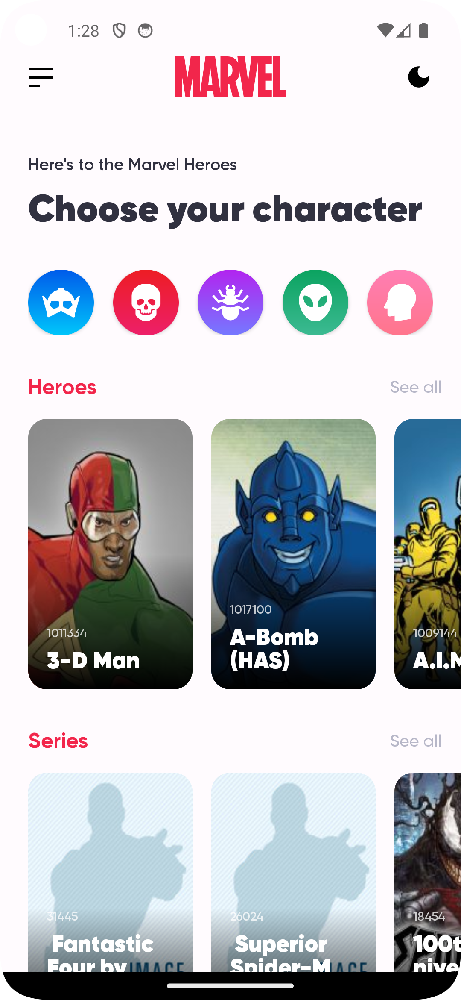
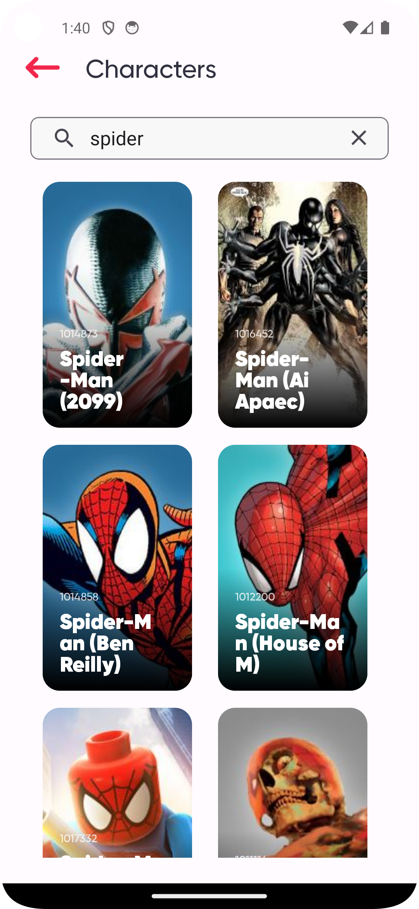
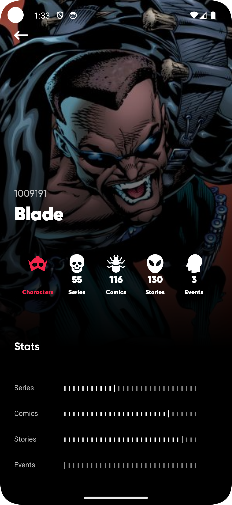
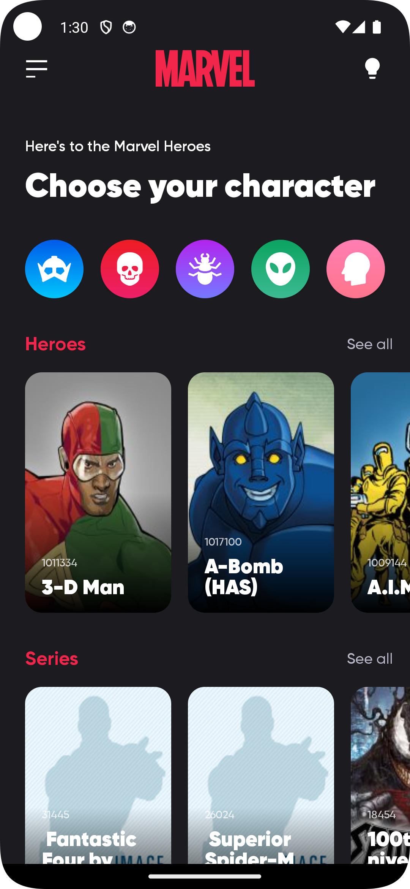
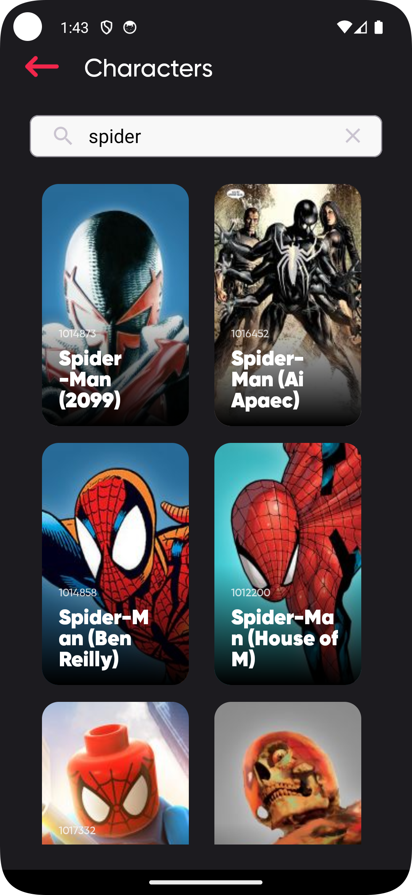

# MARVEL UNIVERSE

&nbsp; &nbsp; &nbsp; 
&nbsp; &nbsp; 

## Techs/Libraries
- [Kotlin](https://developer.android.com/kotlin)
- [Android Jetpack](https://developer.android.com/jetpack)
  - [Navigation Component](https://developer.android.com/guide/navigation/navigation-getting-started)
  - [View Binding](https://developer.android.com/topic/libraries/view-binding)
  - [ViewModel](https://developer.android.com/topic/libraries/architecture/viewmodel)
  - [Lifecycle](https://developer.android.com/topic/libraries/architecture/lifecycle)
- [Retrofit](https://square.github.io/retrofit/)
- [Paging 3](https://developer.android.com/topic/libraries/architecture/paging/v3-overview)
- [Dagger Hilt](https://dagger.dev/hilt/)
- [Kotlin Flow](https://developer.android.com/kotlin/flow)
- [Kotlin Coroutines](https://github.com/Kotlin/kotlinx.coroutines)
- [Material Components](https://github.com/material-components/material-components-android)
- [Glide](https://github.com/bumptech/glide)
- [Safe-Args](https://developer.android.com/guide/navigation/navigation-pass-data)
- [Moshi](https://github.com/square/moshi)
